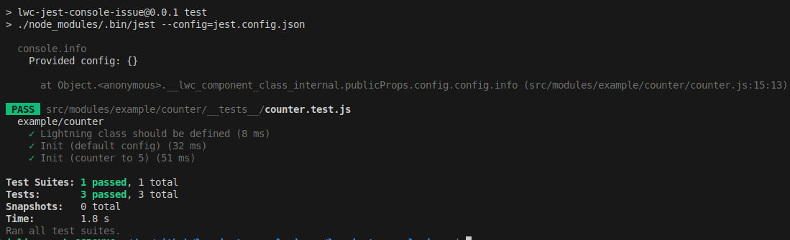
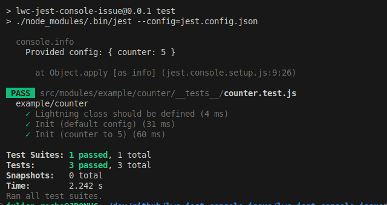

# lwc-jest-console-issue

LWR project to illsutrate issue when we use the Console API in Jest with LWC

## Here come Johnny

If we use some Console API statements such as `console.info` in LWC's tests, we could have some non-obvious behaviour.
Indeed, if in a getter of my LWC components, I have:

```javascript
set config(config) {
    console.info('Provided config:', config);
    this._config = { ...(config ?? DEFAULT_CONFIG) };
    this.counter = this._config.counter;
}
```

When I run Jest tests, I could see:


Because LWC wraps all the objects in a LWC membrame for proxification.
That's why when you run a LWC app, there is a [https://github.com/salesforce/lwc/blob/e0e08795137ae53b5de71cdbaccf036c3fabe5ba/packages/%40lwc/engine-dom/src/formatters/index.ts#L12](Chrome DevTools Custom formatter which is injected) to format the object correctly.

## A solution?

For some reason, the `unwrap` exposed from `@lwc/engine-core` seems not find any referenced wrapped values (despite forcing the `IS_BROWSER` variable).
Then, we should deeply clone the log parameters.

For example, if we load the ` core-js` module, and then we define a Jest' setup file:

```javascript
import 'core-js'; // Loaded through LWC's dependencies, it allows to enable
// a large set of browser's features in Jest, such as 'structuredClone'

const originalConsole = global.console;

global.console = {
  ...global.console,

  info: (...args) => { // Only info at this time
    originalConsole.info.apply(originalConsole, [
      ...Array.from(args).map((obj) => structuredClone(obj)),
    ]);
  },
};
```

Then it will work:



## Commands

### Running the app

```bash
npm install
npm run dev
```

Open the site at [http://localhost:3000](http://localhost:3000)

### Running tests

```bash
npm test
```
